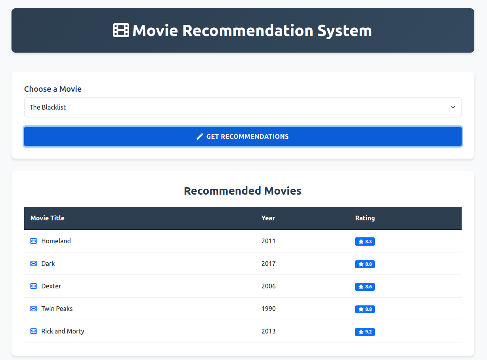

# Movie Recommendation System

This repository contains a **Movie Recommendation System** built using **Flask** and **Machine Learning** techniques. It recommends movies based on content similarity and collaborative filtering using the **K-Nearest Neighbors (KNN)** algorithm.

## Project Structure

```
├── movie-recommendation.py          # Main Flask application
├── Notebook
│   └── Movie-Recommendation-System-1.ipynb   # Jupyter notebook with data analysis & model development
├── templates
│   └── index.html                   # Frontend template for movie selection
└── tests
    └── Movie-Recommendation-System.png   # Test image or system visualization
```

## Features

- Movie recommendations based on user-selected movie.
- Uses **TF-IDF** and **OneHotEncoder** for content-based filtering.
- Implements **KNN** for collaborative filtering.
- Clean and simple Flask web interface.

## How to Run

1. Clone the repository:
   ```bash
   git clone https://github.com/yourusername/Movie-Recommendation-System.git
   ```
2. Install required dependencies:
   ```bash
   pip install -r requirements.txt
   ```
3. Run the Flask app:
   ```bash
   python movie-recommendation.py
   ```

4. Access the app at `http://127.0.0.1:5000/` in your browser.

## Dependencies

- Flask
- scikit-learn
- pandas
- numpy

## Project Demo


